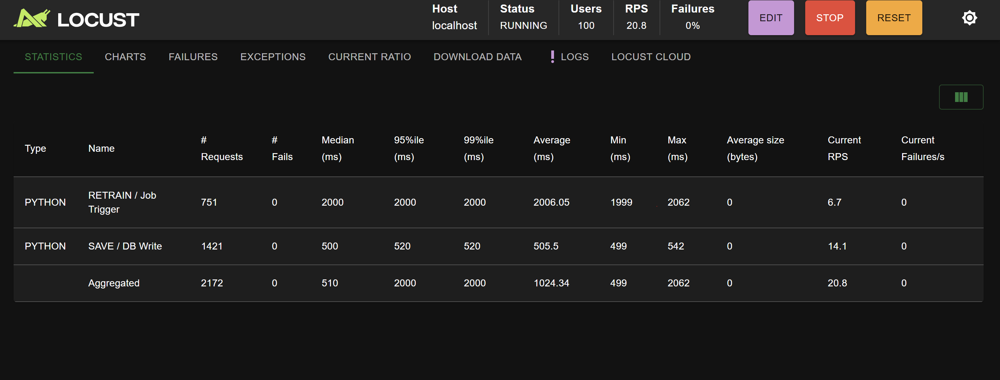

# Breast Cancer Mammogram Classifier with Retraining

This project is a medical AI system that detects breast cancer from mammograms using a deep learning model (EfficientNet-B0). 

**Key Features**
- Mammogram classification (Benign vs Malignant)
- Retraining on new data
- Storing new data to the database
- Downloading improved model (v2) 
- Load testing  using Locust

### Model training details 

| Component                  | Details                                                                 |
|----------------------------|-------------------------------------------------------------------------|
| **Architecture**           | EfficientNet-B0                                           |
| **Total training samples** | **3,383 mammograms** (793 Benign + 2,590 Malignant)                     |
| **Preprocessing**          | Resize to 224×224 → Normalize with ImageNet stats (`mean=[0.485, 0.456, 0.406]`, `std=[0.229, 0.224, 0.225]`) |
| **Data Augmentation**      | RandomHorizontalFlip, RandomVerticalFlip, RandomRotation(20), ColorJitter(brightness=0.4, contrast=0.4), RandomResizedCrop(224) |
| **Optimizer**              | Adam (lr=0.0001)                                      |
| **Loss Function**          | CrossEntropyLoss with class weighting (to handle imbalance)            |
| **Early Stopping**         | Patience = 5 epochs                                                    |
| **Performance**     | ** Accuracy: 72.05%**                                                             |

### Setup & Installation 

1. Clone repository: https://github.com/dianepretty/Summative-assignment---MLOP.git
2. Install dependencies: pip install -r requirements.txt
3. Run app: streamlit run src/app.py

# Locust results
